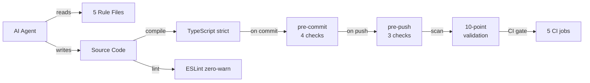
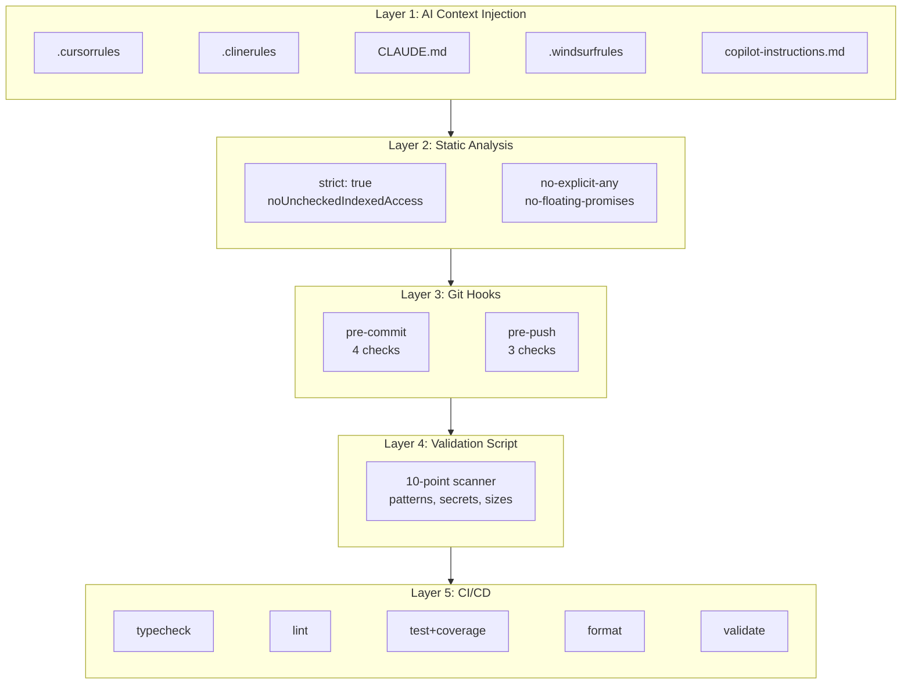
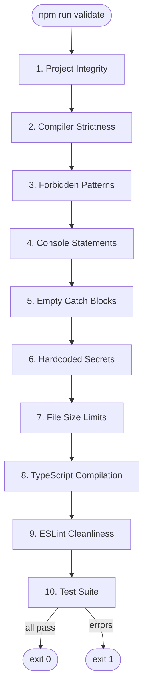

# AI Coding Standards

Enforce production-grade code quality across AI coding agents with rule files, strict configs, and a 10-point validation suite.

[](https://github.com/ntd25022006q/ai-coding-standards/actions)
[](https://opensource.org/licenses/MIT)
[](https://github.com/ntd25022006q/ai-coding-standards)
[](https://www.typescriptlang.org/)
[](https://nodejs.org/)
[](https://github.com/ntd25022006q/ai-coding-standards)

---

## What It Does

AI coding agents produce code quickly, but without enforcement they introduce systemic defects: type erosion from `any` fallbacks, silent error swallowing in empty catch blocks, hardcoded credentials, and stubbed test assertions. This tool provides a multi-layered enforcement framework that blocks, audits, and corrects these patterns before they reach your release branches.

It works through five defense layers, each catching what the previous one misses:

1. **AI Context Injection** -- Rule files that agents read before writing code
2. **Static Analysis & Compiler** -- Strict TypeScript and ESLint configurations
3. **Git Lifecycle Hooks** -- Pre-commit and pre-push hooks that block defective code
4. **Automated Validation** -- A 10-point compliance scanner catching what the compiler misses
5. **CI/CD Pipeline** -- A 5-job GitHub Actions workflow as the final gate

The framework includes ready-to-deploy rule files for five AI agents (Cursor, Windsurf, Claude Code, Cline/Roo Code, and GitHub Copilot), production-grade configuration presets for ESLint, TypeScript, Prettier, and Vitest, and a single command (`npm run setup`) that deploys everything to any target project.

## Architecture





## Features

| Feature                   | Description                                                                                                    |
| ------------------------- | -------------------------------------------------------------------------------------------------------------- |
| 5 AI Agent Rule Files     | Directive files for Cursor, Windsurf, Claude Code, Cline/Roo Code, and GitHub Copilot                          |
| 10-Point Validation Suite | Cross-platform TypeScript scanner for forbidden patterns, secrets, empty catches, and more                     |
| Strict ESLint Config      | Zero-tolerance flat config with type-aware rules and Prettier compatibility                                    |
| Strict TypeScript Base    | `strict: true` with `noUncheckedIndexedAccess`, `noImplicitReturns`, `verbatimModuleSyntax`                    |
| Git Hook Guards           | Pre-commit (4 checks) and pre-push (3 checks) blocking defective code at the git boundary                      |
| CI/CD Pipeline            | 5-job GitHub Actions workflow (typecheck, lint, test+coverage, format-check, validate)                         |
| One-Command Setup         | `npm run setup` deploys all rules, configs, hooks, and docs to any target project                              |
| 30 Absolute Bans          | Catalog of forbidden patterns with correct alternatives                                                        |
| MCP Server Configs        | Pre-configured Model Context Protocol servers (GitHub, filesystem, search, memory, fetch, sequential-thinking) |
| 100% Test Coverage        | 38 tests across 4 test files with full statement/branch/function/line coverage                                 |

## Quick Start

### Prerequisites

- Node.js >= 20.0.0
- npm >= 10.0.0

### Install and Run

```bash
git clone https://github.com/ntd25022006q/ai-coding-standards.git
cd ai-coding-standards
npm install
```

Deploy all rules, hooks, configs, and docs to the current directory:

```bash
npm run setup
```

Or target a specific project:

```bash
npx tsx scripts/setup.ts /path/to/your/project
```

Run the 10-point validation suite:

```bash
npm run validate
```

Run the full quality pipeline locally:

```bash
npm run check:all
```

### Available Commands

| Command                 | Description                                   |
| ----------------------- | --------------------------------------------- |
| `npm run validate`      | 10-point validation suite                     |
| `npm run setup`         | Deploy rules, configs, hooks, and docs        |
| `npm run typecheck`     | TypeScript compilation check (`tsc --noEmit`) |
| `npm run lint`          | ESLint with zero warnings                     |
| `npm run lint:fix`      | ESLint with auto-fix                          |
| `npm run test`          | Run test suite with Vitest                    |
| `npm run test:coverage` | Run tests with coverage reporting             |
| `npm run format:check`  | Check Prettier formatting                     |
| `npm run format`        | Auto-format with Prettier                     |
| `npm run build`         | Validate TypeScript compilation               |
| `npm run check:all`     | Run all checks in sequence                    |

## Validation Suite

The 10-point validation script (`scripts/validate.ts`) scans the project for compliance violations. It is written in TypeScript and runs via `tsx`, working natively on Windows, macOS, and Linux.



### Check Details

| #   | Check                  | Severity | What It Catches                                                         |
| --- | ---------------------- | -------- | ----------------------------------------------------------------------- |
| 1   | Project Integrity      | CRITICAL | Missing `package.json`, `tsconfig.json`, `.gitignore`, or AI rule files |
| 2   | Compiler Strictness    | CRITICAL | `"strict": true` not enabled in tsconfig.json                           |
| 3   | Forbidden Patterns     | CRITICAL | `as any`, `: any`, `@ts-ignore`, `@ts-expect-error` in source           |
| 4   | Console Statements     | WARNING  | `console.log` left in production source under `src/`                    |
| 5   | Empty Catch Blocks     | CRITICAL | Silent error swallowing -- `catch (e) {}` or `catch {}`                 |
| 6   | Hardcoded Secrets      | CRITICAL | `password=`, `api_key=`, `secret=`, `sk-` tokens, `AIza` keys           |
| 7   | File Size Limits       | WARNING  | Source files exceeding 300 lines                                        |
| 8   | TypeScript Compilation | CRITICAL | `tsc --noEmit` produces errors                                          |
| 9   | ESLint Cleanliness     | CRITICAL | `eslint --max-warnings=0` produces errors or warnings                   |
| 10  | Test Suite             | CRITICAL | Test runner reports failures                                            |

The script exits with code 0 if all checks pass (warnings allowed) and code 1 if any CRITICAL check fails.

## AI Rule Files

Five rule files, each tailored to a specific AI coding agent. All share the same core directives -- 30 absolute bans, strict TypeScript rules, mandatory error handling, testing requirements, and security checklists -- but differ in how each agent loads them.

| Agent            | Rule File                         | Lines |
| ---------------- | --------------------------------- | ----- |
| Cursor           | `.cursorrules`                    | 442   |
| Windsurf         | `.windsurfrules`                  | 442   |
| Claude Code      | `CLAUDE.md`                       | 580   |
| Cline / Roo Code | `.clinerules`                     | 438   |
| GitHub Copilot   | `.github/copilot-instructions.md` | ~400  |

### 30 Absolute Bans

| #   | Forbidden                              | Use Instead                  |
| --- | -------------------------------------- | ---------------------------- |
| 1   | `any` type                             | `unknown` + type guard       |
| 2   | `console.log` in production            | Structured logger            |
| 3   | Hardcoded values                       | Constants / config files     |
| 4   | Inline styles                          | Tailwind CSS classes         |
| 5   | Direct DOM manipulation                | React refs / state           |
| 6   | `@ts-ignore`                           | Fix the type properly        |
| 7   | Mock data without MSW flag             | Mock Service Worker          |
| 8   | `useEffect` for data fetching          | React Query / SWR            |
| 9   | Nesting > 3 levels                     | Extract into components      |
| 10  | Components > 200 lines                 | Split into smaller pieces    |
| 11  | Files > 300 lines                      | Split into modules           |
| 12  | Circular dependencies                  | Dependency injection         |
| 13  | `!` non-null assertion                 | Proper null checks           |
| 14  | Empty catch blocks                     | Handle or rethrow            |
| 15  | `eval()`, `Function()`, `innerHTML`    | Safe alternatives            |
| 16  | Comments explaining WHAT               | Self-documenting code        |
| 17  | Deleting files without permission      | Always ask first             |
| 18  | Manually editing package.json          | Use npm/yarn/pnpm commands   |
| 19  | Skipping tests                         | Every feature needs tests    |
| 20  | Magic numbers                          | Named constants              |
| 21  | `var` keyword                          | `const` or `let`             |
| 22  | Default exports only                   | Named exports (except pages) |
| 23  | Barrel files without tree-shaking      | Direct imports               |
| 24  | API requests without limits            | Always use pagination        |
| 25  | Synchronous file operations            | Always use async/await       |
| 26  | Mutable default parameters             | Immutable patterns           |
| 27  | Unused imports/variables               | Remove immediately           |
| 28  | Multiple responsibilities per function | Single responsibility        |
| 29  | `fetch()` without error handling       | Wrap in try/catch with types |
| 30  | Fabricating API information            | Use official docs only       |

## Source Code

The `src/` directory contains example utility functions and domain types that demonstrate the coding standards this tool enforces. It exports from a single barrel entry point:

```ts
// src/index.ts -- barrel exports
export { formatCurrency, clampValue, safeJsonParse, delay } from './lib/utils';
export type {
  BaseEntity,
  UserRole,
  User,
  ApiErrorResponse,
  ApiSuccessResponse,
  ApiResponse,
  PaginationParams,
  PaginationMeta,
} from './types/index';
```

### Utility Functions (`src/lib/utils.ts`)

```ts
// Formats a numeric amount as a currency string
formatCurrency(1000); // '$1,000'
formatCurrency(1234.567); // '$1,234.57'
formatCurrency(100, 'EUR'); // '€100'

// Clamps a value between min and max (inclusive)
clampValue(5, 0, 10); // 5
clampValue(-3, 0, 10); // 0
clampValue(100, 0, 10); // 10

// Safely parses JSON without throwing
const result = safeJsonParse<User>('{"id":1}');
if (result.data) {
  /* use result.data */
} else {
  /* handle result.error */
}

// Returns a promise that resolves after N milliseconds
await delay(1000); // wait 1 second
```

### Domain Types (`src/types/index.ts`)

```ts
interface BaseEntity {
  id: string;
  createdAt: Date;
  updatedAt: Date;
}
type UserRole = 'admin' | 'user' | 'moderator';
interface User extends BaseEntity {
  email: string;
  name: string;
  role: UserRole;
  isActive: boolean;
}
type ApiResponse<T> = ApiSuccessResponse<T> | ApiErrorResponse; // discriminated union
interface PaginationParams {
  page: number;
  limit: number;
}
interface PaginationMeta {
  page: number;
  limit: number;
  total: number;
  totalPages: number;
}
```

## Configuration

### ESLint

Zero-tolerance flat config with type-aware rules:

```js
'@typescript-eslint/no-explicit-any': 'error',          // Blocks `any` usage
'@typescript-eslint/no-floating-promises': 'error',      // Catches unhandled promises
'@typescript-eslint/consistent-type-imports': ['error', { prefer: 'type-imports' }],
'@typescript-eslint/explicit-function-return-type': ['error', { allowExpressions: true }],
'@typescript-eslint/no-non-null-assertion': 'error',     // Blocks `!` operator
'no-console': ['error', { allow: ['warn', 'error'] }],   // Blocks console.log
'no-empty': ['error', { allowEmptyCatch: false }],       // Blocks empty catch blocks
eqeqeq: ['error', 'always'],
curly: ['error', 'all'],
```

### TypeScript

Base config (`configs/typescript/tsconfig.base.json`) goes beyond `strict: true`:

```json
{
  "strict": true,
  "noUncheckedIndexedAccess": true,
  "noImplicitReturns": true,
  "noFallthroughCasesInSwitch": true,
  "forceConsistentCasingInFileNames": true,
  "noUnusedLocals": true,
  "noUnusedParameters": true,
  "verbatimModuleSyntax": true
}
```

### Prettier

```json
{ "semi": true, "singleQuote": true, "tabWidth": 2, "trailingComma": "all", "printWidth": 100 }
```

### Vitest

80% coverage threshold across all metrics, v8 provider:

```ts
coverage: {
  provider: 'v8',
  include: ['src/**/*.{ts,tsx}'],
  thresholds: { branches: 80, functions: 80, lines: 80, statements: 80 },
}
```

## Project Structure

```
ai-coding-standards/
├── CLAUDE.md                          # Claude Code CLI rules
├── .cursorrules                       # Cursor IDE rules
├── .clinerules                        # Cline / Roo Code rules
├── .windsurfrules                     # Windsurf IDE rules
├── eslint.config.mjs                  # Root ESLint config
├── tsconfig.json                      # Root TypeScript config
├── vitest.config.ts                   # Vitest test runner config
├── package.json                       # v2.3.0, ESM, zero runtime deps
│
├── .github/
│   ├── copilot-instructions.md        # GitHub Copilot rules
│   └── workflows/
│       ├── ci.yml                     # 5-job CI pipeline
│       └── quality-check.yml          # Extended quality workflow
│
├── configs/
│   ├── eslint/                        # Standard + Next.js ESLint presets
│   ├── github/                        # GitHub Actions template
│   ├── prettier/                      # Prettier config template
│   ├── testing/                       # Vitest config template
│   └── typescript/                    # Base TypeScript preset
│
├── docs/
│   ├── RULES.md                       # 14-part coding standards
│   ├── ANTI-PATTERNS.md               # 30 anti-patterns catalog
│   ├── ARCHITECTURE.md                # Architecture guide
│   ├── SECURITY.md                    # OWASP Top 10 prevention
│   └── COMPARISON.md                  # Comparison with traditional QA
│
├── hooks/
│   ├── pre-commit                     # 4 checks: tsc, eslint, patterns, console
│   └── pre-push                       # 3 checks: validation, build, tests
│
├── mcp/
│   ├── mcp-config.json                # 6 MCP server configs
│   └── tools/optional-mcp-tools.json  # Optional MCP tool definitions
│
├── scripts/
│   ├── setup.ts                       # Cross-platform project setup
│   ├── setup.sh                       # Shell fallback
│   ├── validate.ts                    # 10-point validation script
│   └── validate.sh                    # Shell fallback
│
├── src/
│   ├── index.ts                       # Barrel exports (4 functions, 8 types)
│   ├── lib/utils.ts                   # formatCurrency, clampValue, safeJsonParse, delay
│   └── types/index.ts                 # BaseEntity, User, ApiResponse, PaginationMeta
│
└── tests/
    ├── unit/
    │   ├── utils.test.ts              # 24 unit tests
    │   └── exports.test.ts            # 3 barrel export tests
    └── integration/
        ├── eslint-config.test.ts      # 5 ESLint config tests
        └── repo-integrity.test.ts     # 6 repo integrity tests
```

## Contributing

1. Fork the repository
2. Create a feature branch: `git checkout -b feature/your-feature`
3. Make your changes following the coding standards enforced by this repository
4. Run the full quality pipeline: `npm run check:all`
5. Commit with [Conventional Commits](https://www.conventionalcommits.org/):

   ```
   feat(scope): add new validation check
   fix(hooks): resolve pre-commit false positive
   docs(readme): update architecture diagram
   ```

6. Push and open a pull request

All pull requests are validated by the CI pipeline. The `prepare` script automatically activates git hooks after `npm install`, so pre-commit and pre-push checks run locally before you push.

## License

[MIT](LICENSE) — Copyright &copy; 2026 Nguyen Tien Dat. All rights reserved.
